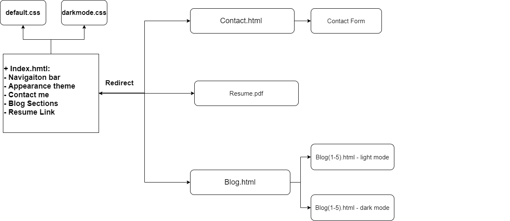

# Ethan Tran's Porfolio 
## URL:
https://ethantranporfolio.netlify.app/

## GitHub Link:
https://github.com/Neymartri/T1A2---Portfolio/tree/master 

### Discription: 
 - <b>Purpose</b>: The purpose of this website is to reflect my working skills and personality interest. 
 
- The intention of this website was to increase the visibility of my personal branding to get connect closer to clients and employers. 

-<b>Features & Functionality</b>:
<ol>
    <li>The brief intro designed with a Nav. bar, anchor sections and redirect to all pages.</li>
    <li>Ulitlising of flex grid layout and css animations</li>
    <li>Box shadow effect and webkit shadow* for a playful design also helps indicating the elements have functionality usage</li>
    <li>Implementing a dark and light mode html theme for user accessiblity </li>
    <li>Links to resume pdf and social links</li>
    <li>blog sections for brief overview of content to transfer to blog.hmtl</li>
    <li> A functional contact form that can recieve email through 3rd party application*</li>
</ol>

## Sitemap: 

## Screenshots: 
#### Intro-wrapper: 

#### About-wrapper:

#### Blogs: 

#### Contact: 

## Target audiences: 
- Employers or HR representatives
- Clients and colleagues 
- Developers 

## Techstack: 
- html 5 
- Vanilla Css
- Git 
- Sitemap: https://app.diagrams.net/ 
- Wireframe: Balsamiq Wireframe 
- Screenshots: Snipping Tool 
- Presentaiton: Figma convert to Powerpoint 
- Hosting server: https://app.netlify.com/teams/neymartri/overview
- Google fonts: https://fonts.google.com/
- Github 

### *References to outsourced contents & 3rd party app: 
- Functional send button: https://formspree.io/ 
- Webkit boxshadow: https://html-css-js.com/css/generator/box-shadow/
- Contact form inspiration: https://codepen.io/search/pens?q=contact+form 

